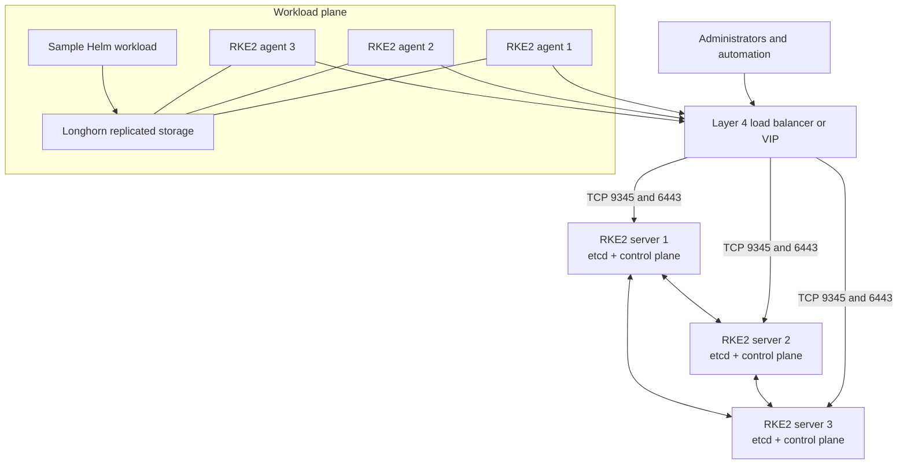

# RKE2 High-Availability Platform Reference

[](https://github.com/natnaela-devops/kubernetes-rke2-cluster-setup/actions/workflows/validate.yml)

A sanitized, production-inspired reference for building and operating an RKE2 Kubernetes platform with a highly available control plane, dedicated worker nodes, Longhorn storage, security controls, and automated manifest validation.

This repository demonstrates design and operational patterns. It is not a one-command production installer: addresses, DNS names, tokens, certificates, capacity, recovery objectives, and security policy must be adapted and tested for each environment.

## Architecture



The topology follows the RKE2 HA model: a stable registration endpoint, three server nodes for etcd quorum, and separate agents for application workloads. Rancher can import and manage the resulting cluster; Rancher installation is intentionally outside this repository.

## What this demonstrates

- Valid native RKE2 server and agent configuration files instead of an invented Kubernetes custom resource
- Three-server etcd quorum behind a fixed registration and API endpoint
- Dedicated control-plane nodes using taints and dedicated workload nodes using labels
- Secrets encryption at rest, Kubernetes audit policy, Pod Security Admission, and restricted kubeconfig permissions
- Scheduled, compressed etcd snapshots with documented recovery responsibilities
- Longhorn installed through the RKE2 Helm controller, pinned to `1.11.2`
- A separate `Retain` storage class for workloads whose volumes must survive PVC deletion
- A real Helm chart with probes, resource controls, a PodDisruptionBudget, NetworkPolicy, and non-root execution
- YAML, shell, Helm, and Kubernetes schema checks in GitHub Actions

## Repository layout

```text
.
├── .github/workflows/validate.yml
├── charts/platform-demo/
├── config/
│   ├── agent.yaml
│   ├── audit-policy.yaml
│   ├── psa.yaml
│   ├── registries.yaml.example
│   ├── server-bootstrap.yaml
│   └── server-join.yaml
├── docs/operations-runbook.md
├── examples/haproxy.cfg
├── manifests/longhorn/
├── scripts/preflight.sh
├── scripts/validate.sh
└── Makefile
```

## Secure deployment workflow

1. Replace every `example.com`, `192.0.2.0/24`, and token-file placeholder with environment-specific values. The example IPs are documentation-only addresses.
2. Run `sudo ./scripts/preflight.sh` on every planned node and resolve all reported failures.
3. Complete the operating-system preparation required by the official RKE2 CIS hardening guide before enabling `profile: cis`.
4. Create `/etc/rancher/rke2/token` with the same strong, randomly generated value on all nodes and set permissions to `0600`. Never commit the token.
5. Copy the appropriate configuration to `/etc/rancher/rke2/config.yaml`. Copy `audit-policy.yaml` and `psa.yaml` to the paths referenced by the server configuration.
6. Install a tested, explicitly pinned RKE2 patch release from the supported Kubernetes minor selected for the environment. Start the bootstrap server, then the two joining servers, and finally the agents.
7. Confirm all nodes are `Ready`, validate etcd snapshots, and test loss of one server before onboarding workloads.
8. Apply `manifests/longhorn/helmchart.yaml`, wait for Longhorn to become healthy, and then apply `manifests/longhorn/storageclass-retain.yaml`.
9. Deploy the sample workload with `helm upgrade --install platform-demo charts/platform-demo --namespace platform-demo --create-namespace`.

Detailed verification and recovery steps are in [the operations runbook](docs/operations-runbook.md).

## Local validation

```bash
make validate
```

The validation script uses `yamllint`, `shellcheck`, `helm`, and `kubeconform`. It fails fast when a required tool is missing and prints installation guidance.

## Design decisions

- **No secrets in Git:** joining credentials live in a root-owned token file.
- **No single-server HA claim:** the reference uses three server nodes because etcd requires quorum.
- **Control-plane isolation:** server nodes are tainted; platform and application pods run on agents unless explicitly tolerated.
- **Recoverability over appearance:** etcd snapshot restore and Longhorn backup testing are deployment gates, not future improvements.
- **Version discipline:** the Longhorn chart is pinned. RKE2 must also be pinned by the operator after compatibility testing rather than silently following a moving channel in production.
- **Safe public examples:** names, addresses, and workloads are fictional and expose no employer or customer infrastructure.

## Upstream references

- [RKE2 high availability](https://docs.rke2.io/install/ha)
- [RKE2 server configuration reference](https://docs.rke2.io/reference/server_config)
- [RKE2 CIS hardening guide](https://docs.rke2.io/security/hardening_guide)
- [Longhorn installation requirements](https://longhorn.io/docs/1.11.2/deploy/install/)

## License

MIT
